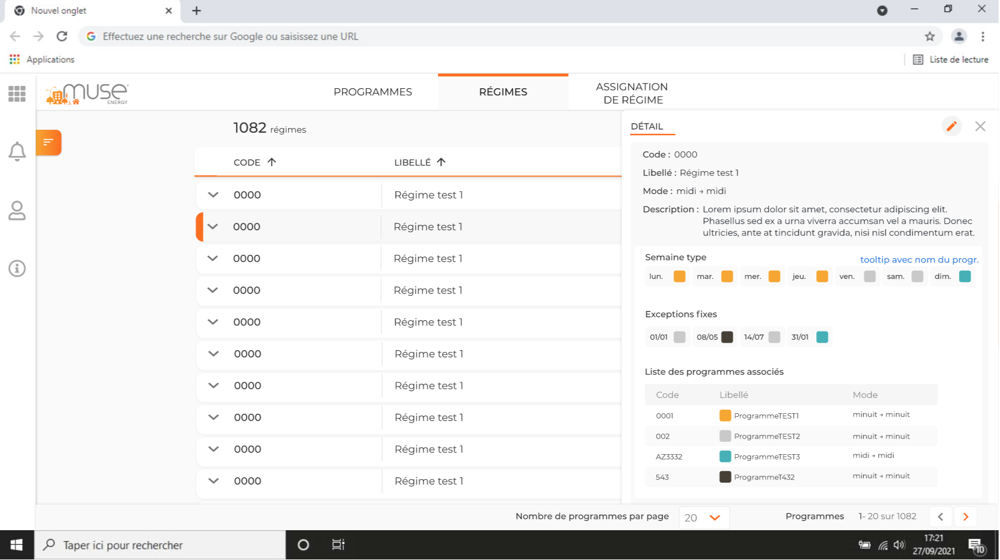
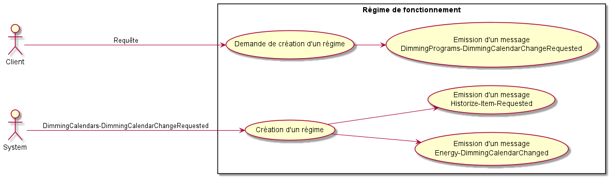
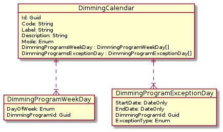
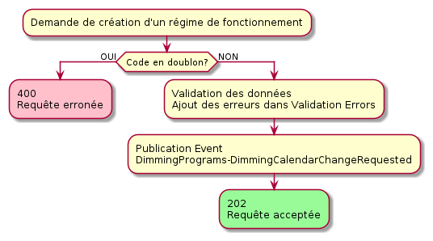
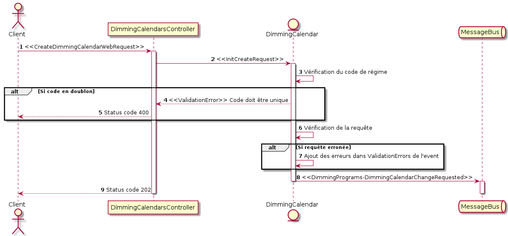
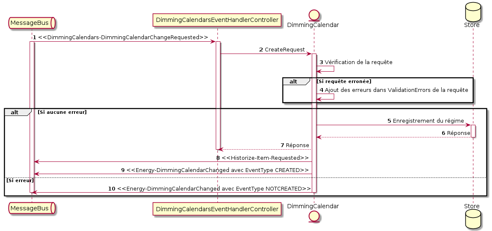

# **Dossier de conception de Dimming Calendars**

- [**Dossier de conception de Dimming Calendars**](#dossier-de-conception-de-dimming-calendars)
  - [**Description**](#description)
    - [_Affichage utilisateur attendu_](#affichage-utilisateur-attendu)
  - [**Cas d'utilisation**](#cas-dutilisation)
    - [_Diagramme general_](#diagramme-general)
    - [_Entites du domaine_](#entites-du-domaine)
      - [Aggregate root](#aggregate-root)
      - [Entites](#entites)
  - [**Fiches des Uses Cases**](#fiches-des-uses-cases)
  - [**Actions utilisateurs / systemes**](#actions-utilisateurs--systemes)
    - [_Demande de creation d'un regime de fonctionnement_](#demande-de-creation-dun-regime-de-fonctionnement)
      - [Requete](#requete)
      - [Reponse](#reponse)
      - [Erreurs](#erreurs)
      - [Regles metiers](#regles-metiers)
      - [Diagramme de sequence](#diagramme-de-sequence)
  - [**Evenements du domaine**](#evenements-du-domaine)
  - [_Detail des evenements ecoutes_](#detail-des-evenements-ecoutes)
    - [Use Case : _Creation d'un regime de fonctionnement_](#use-case--creation-dun-regime-de-fonctionnement)
      - [Message: DimmingCalendars-DimmingCalendarChangeRequested](#message-dimmingcalendars-dimmingcalendarchangerequested)
      - [Diagramme de sequence](#diagramme-de-sequence-1)
  - [_Detail des evenements emis_](#detail-des-evenements-emis)
      - [Message : DimmingPrograms-DimmingCalendarChangeRequested](#message--dimmingprograms-dimmingcalendarchangerequested)
      - [Message : Energy-DimmingCalendarChanged](#message--energy-dimmingcalendarchanged)
      - [Message:HistorizeItemRequested](#messagehistorizeitemrequested)
  - [**Interfaçage avec l'exterieur**](#interfaçage-avec-lexterieur)
    - [_Persistance des donnees de reference_](#persistance-des-donnees-de-reference)
  - [**Implementation technique**](#implementation-technique)
    - [_Choix techniques_](#choix-techniques)
    - [_Infrastructure utilisee_](#infrastructure-utilisee)
  - [**Cas de tests**](#cas-de-tests)
  - [**Annexes**](#annexes)
    - [_Api publique_](#api-publique)


## **Description**

<br>

Ce µService est responsable du chargement des régimes de fonctionnement :
- La création d'un régime.
- La modification d'un régime (à venir).
- La suppression d'un régime (à venir).

Ce µservice est impliqué dans la chorégraphie de gestion d'un régime de fonctionnement (création, modification, suppression)

[Chorégraphie](Chorégraphie.md)

<br>

### _Affichage utilisateur attendu_ 

<br>



<br>

<hr>

<br>

## **Cas d'utilisation**

<br>

### _Diagramme general_

<br>



<br>

[**Fiches des Uses Cases**](#fiches-des-uses-cases)

<br>
<br>

### _Entites du domaine_

<br>



#### Aggregate root

<br>

 - **DimmingCalendar**

Représente l'_aggregate root_ du domaine des régimes de fonctionnement.

| Propriété                   | Type                         | Description                                     | Requis | Contraintes |
| --------------------------- | ---------------------------- | ----------------------------------------------- | ------ | ----------- |
| Id                          | Guid                         | Identifiant du Régime                           | Oui    | Unique      |
| Code                        | String                       | Code du régime                                  | Oui    | Unique      |
| Label                       | String                       | Libellé du régime                               | Oui    |             |
| Description                 | String                       | Description du régime                           | Non    |             |
| Mode                        | Enum                         | Mode de fonctionnement du régime                | Oui    |             |
| DimmingProgramsWeekDay      | DimmingProgramWeekDay[]      | Programmes affectés à chaque jour de la semaine | Oui    |             |
| DimmingProgramsExceptionDay | DimmingProgramExceptionDay[] | Programmes affectés aux exceptions              | Non    |             |

<br>

#### Entites

<br>

- **DimmingProgramWeekDay**

Représente le programme affecté à un jour de la semaine.

| Propriété        | Type | Description              | Requis | Contraintes |
| ---------------- | ---- | ------------------------ | ------ | ----------- |
| DayOfWeek        | Enum | Jour de la semaine       | Oui    | Unique      |
| DimmingProgramId | Guid | Identifiant du programme | Oui    |             |

<br>

- **DimmingProgramExceptionDay**

Représente le programme affecté à un jour répété annuellement ou un jour calendaire unique.

| Propriété        | Type     | Description                  | Requis | Contraintes |
| ---------------- | -------- | ---------------------------- | ------ | ----------- |
| StartDate        | DateOnly | Date de début de l'exception | Oui    |             |
| EndDate          | DateOnly | Date de fin de l'exception   | Oui    |             |
| DimmingProgramId | Guid     | Identifiant du programme     | Oui    |             |
| ExceptionType    | Enum     | Type d'exception             | Oui    |             |

DateOnly au format CultureInfo.InvariantCulture

<br>

- **OperatingMode**

Enum décrivant les mode de fonctionnement

| Nom              | Value | Description      |
| ---------------- | ----- | ---------------- |
| MidnightMidnight | 0     | Minuit -> Minuit |
| NoonNoon         | 1     | Midi -> Midi     |

<br>

- **DayOfWeek**

Enum décrivant les jours de la semaine

| Nom       | Value | Description |
| --------- | ----- | ----------- |
| Monday    | 0     | Lundi       |
| Tuesday   | 1     | Mardi       |
| Wednesday | 2     | Mercredi    |
| Thursday  | 3     | Jeudi       |
| Friday    | 4     | Vendredi    |
| Saturday  | 5     | Samedi      |
| Sunday    | 6     | Dimanche    |

<br>

- **ExceptionType**

Enum décrivant le type d'exception (fixe ou calendaire)

| Nom      | Value | Description                        |
| -------- | ----- | ---------------------------------- |
| Fixed    | 0     | Exception fixe répété annuellement |
| Calendar | 1     | Exception calendaire unique        |

<br>

<hr>

<br>

## **Fiches des Uses Cases**

| Nom du Use case                                   | Acteur                                                                                                                          | Intervenants et intérêts | Contexte d'utilisation                                                                                                                                                    | Diagramme de séquence            |
| ------------------------------------------------- | ------------------------------------------------------------------------------------------------------------------------------- | ------------------------ | ------------------------------------------------------------------------------------------------------------------------------------------------------------------------- | -------------------------------- |
| Demande de création d'un régime de fonctionnement | L'acteur est utilisateur de l'API du µService . Il peut s'agir d'une application web (comme MUSE Energy) ou d'un autre service. | /                        | Demande de création d'un régime nécessitant la validation de l'existence des programmes.<br />- [ART-144](https://muse-software.aha.io/features/ART-144)<br />            | [Lien](#diagramme-de-sequence-1) |
| Création d'un régime de fonctionnement            | Système                                                                                                                         | /                        | Création d'un régime suite à la réception de la demande de validation de l'existence de programmes.<br />- [ART-144](https://muse-software.aha.io/features/ART-144)<br /> | [Lien](#diagramme-de-sequence-2) |

<br>

<hr>

<br>

## **Actions utilisateurs / systemes**

<br>

### _Demande de creation d'un regime de fonctionnement_

<br>

#### Requete

* Url : /api/v1/dimming-calendars/
* Méthode : POST
* Entête :
  * x-UserContext : {"UserId": "66f159d2-7fca-4710-b4ac-03f153751711"} pour l'historisation
* Contenu : Représente le régime de fonctionnement à créer
```json
{
  "label": "Test Régime",
  "code": "1234",
  "description":"Description du régime",
  "mode": 1,
  "dimmingProgramsWeekDay": [
    {
      "dayOfWeek": 0,
      "dimmingProgramId": "870ca9d9-0064-4bbf-9c43-a5335b95fc3a"
    },
    {
      "dayOfWeek": 1,
      "dimmingProgramId": "870ca9d9-0064-4bbf-9c43-a5335b95fc3a"
    },
    ...
  ],
  "dimmingProgramsExceptionDay": [
    {
      "startDate": "01/01/2022",
      "endDate": "01/01/2022",
      "dimmingProgramId": "870ca9d9-0064-4bbf-9c43-a5335b95fc3a",
      "exceptionType": 0
    },
    {
      "startDate": "05/01/2022",
      "endDate": "05/01/2022",
      "dimmingProgramId": "870ca9d9-0064-4bbf-9c43-a5335b95fc3a",
      "exceptionType": 0
    },
    {
      "startDate": "05/26/2022",
      "endDate": "05/26/2022",
      "dimmingProgramId": "870ca9d9-0064-4bbf-9c43-a5335b95fc3a",
      "exceptionType": 1
    },
    ...
  ]
}
```

<br>

| Propriétés                  |                  | Type     | Description                                                                     |
| --------------------------- | ---------------- | -------- | ------------------------------------------------------------------------------- |
| label                       |                  | String   | Libellé du régime                                                               |
| code                        |                  | String   | Code du régime                                                                  |
| description                 |                  | String   | Description du régime                                                           |
| mode                        |                  | Enum     | 0 = Minuit -> Minuit, 1 = Midi -> Midi                                          |
| dimmingProgamsWeekDays      |                  | Object[] | Programmes affectés à chaque jour de la semaine                                 |
|                             | dayOfWeek        | Enum     | 0 = Lundi => 6 = Dimanche                                                       |
|                             | dimmingProgramId | Guid     | Identifiant du programme                                                        |
| dimmingProgamsExceptionDays |                  | Object[] | Programmes affectés à un jour répété annuellement ou un jour calendaire unique. |
|                             | startDate        | DateOnly | Date de début de l'exception                                                    |
|                             | endDate          | DateOnly | Date de fin de l'exception                                                      |
|                             | dimmingProgramId | Guid     | Identifiant du programme                                                        |
|                             | exceptionType    | Enum     | 0 = Jour fixe, 1 = Jour calendaire                                              |


<br>

#### Reponse

* Code : 202
* Contenu : Pas de données dans la réponse

<br>

#### Erreurs

<br>

| Code | Détail                                      |
| ---- | ------------------------------------------- |
| 400  | Code du régime déjà utilisé                 |
| 400  | Propriété(s) obligatoire(s) non présente(s) |
| 400  | Type de propriété invalide                  |

<br>
<br>

#### Regles metiers

<br>

- Le code d'un régime doit être unique
- Les propriété suivantes sont obligatoires :
  - Code
  - Label
  - Mode
- Mode doit être de type OperatingMode.
- DayOfWeek doit être de type DayOfWeek.
- Chaque jour de la semaine doit être associé à un programme.
- Il ne peut y avoir 2 programmes pour la même exception (type et date).
- La date de début et la date de fin d'exception doivent être égales actuellement (Pas de gestion de plages).
- ExceptionType doit être de type ExceptionType. 
- On ne gère pas de permissions pour le moment

Dans le diagramme d'activité ci-dessous, nous allons traiter le cas de création d'un régime de fonctionnement du microservice Energy.DimmingCalendars:

<br>



<br>

#### Diagramme de sequence

<br>



<br>

<br>
    <hr>
<br>

## **Evenements du domaine**

<br>

Cette application écoute les évènements suivants :

| Nom                                             | Topic                                           | Description                                           |
| :---------------------------------------------- | :---------------------------------------------- | :---------------------------------------------------- |
| DimmingCalendars-DimmingCalendarChangeRequested | dimmingcalendars-dimmingcalendarchangerequested | Confirme l'existence des programmes de fonctionnement |

<br>

## _Detail des evenements ecoutes_

<br>
<br>

### Use Case : _Creation d'un regime de fonctionnement_
#### Message: DimmingCalendars-DimmingCalendarChangeRequested
**Topic :** dimmingcalendars-dimmingcalendarchangerequested

<br>

Evènement attendu:
```json
  {   
		"EventId": "0d4f4a88-9428-4d09-b4db-64130eb7a33f",
		"Timestamp": "2021-12-22T10:33:40.2899005+00:00",
		"EventType": "CREATING",
    "CorrelationId": "e60b7ad3-65fd-4d44-83ee-3831613ae4a1",
    "ValidationErrors": [],
    "UserId": "66f159d2-7fca-4710-b4ac-03f153751711",
		"Content": {
      "Id":"56DADA0A-DAC6-4A51-A709-6BA681128698",
			"Mode": "NoonNoon",
			"Description":"Description du régime",
			"Code": "1234",
			"Label": "Test Régime",
      "DimmingProgramsWeekDay": [
        {
          "DayOfWeek": "Monday",
          "DimmingProgramId": "870ca9d9-0064-4bbf-9c43-a5335b95fc3a"
        },
        {
          "DayOfWeek": "Tuesday",
          "DimmingProgramId": "870ca9d9-0064-4bbf-9c43-a5335b95fc3a"
        },
        ...
      ],
      "DimmingProgramsExceptionDay": [
        {
          "StartDate": "01/01/2022",
          "EndDate": "01/01/2022",
          "DimmingProgramId": "870ca9d9-0064-4bbf-9c43-a5335b95fc3a",
          "ExceptionType": "Fixed"
        },
        {
          "StartDate": "05/01/2022",
          "EndDate": "05/01/2022",
          "DimmingProgramId": "870ca9d9-0064-4bbf-9c43-a5335b95fc3a",
          "ExceptionType": "Fixed"
        },
        {
          "StartDate": "05/26/2022",
          "EndDate": "05/26/2022",
          "DimmingProgramId": "870ca9d9-0064-4bbf-9c43-a5335b95fc3a",
          "ExceptionType": "Calendar"
        },
        ...
      ],
      "UnknownFields": []
		}
  }
```

| Propriété        |                             |                  | Type     | Description                                                             |
| ---------------- | --------------------------- | ---------------- | -------- | ----------------------------------------------------------------------- |
| EventId          |                             |                  | Guid     | Identifiant de l'évènement                                              |
| Timestamp        |                             |                  | Date     | Date d'émission de l'évènement                                          |
| EventType        |                             |                  | Enum     | Statut de l'évènement 6 = CREATING, 7 = UPDATING, 8 = DELETING          |
| CorrelationId    |                             |                  | Guid     | Identifiant de corrélation                                              |
| ValidationErrors |                             |                  | Object[] | Liste d'erreurs                                                         |
|                  | AppId                       |                  | String   | Identifiant du µService à l'origine de l'erreur                         |
|                  | Timestamp                   |                  | Date     | Timestamp de l'erreur                                                   |
|                  | Code                        |                  | Int      | Http Status Code de l'erreur                                            |
|                  | Message                     |                  | String   | Message de l'erreur                                                     |
| UserId           |                             |                  | String   | UserId récupérant depuis le Header de la requête initiale               |
| Content          |                             |                  | Object   | Contenu de l'évènement                                                  |
|                  | Id                          |                  | Guid     | Identifiant du régime                                                   |
|                  | Mode                        |                  | Enum     | 0 = Minuit -> Minuit, 1 = Midi -> Midi                                  |
|                  | Code                        |                  | String   | Code du régime                                                          |
|                  | Label                       |                  | String   | Libellé du régime                                                       |
|                  | Description                 |                  | String   | Description du régime                                                   |
|                  | DimmingProgamsWeekDays      |                  | Object[] | Programmes affectés à chaque jour de la semaine                         |
|                  |                             | DayOfWeek        | Enum     | 0 = Lundi => 6 = Dimanche                                               |
|                  |                             | DimmingProgramId | Guid     | Identifiant du programme                                                |
|                  | DimmingProgamsExceptionDays |                  | Object[] | Programmes affectés à un jour répété annuellement ou un jour calendaire |
|                  |                             | StartDate        | DateOnly | Date de début de l'exception                                            |
|                  |                             | EndDate          | DateOnly | Date de fin de l'exception                                              |
|                  |                             | DimmingProgramId | Guid     | Identifiant du programme                                                |
|                  |                             | ExceptionType    | Enum     | 0 = Jour fixe, 1 = Jour calendaire                                      |
|                  | UnknownFields               |                  | Object[] | Dictionnaire reprenant les propriétés inconnues                         |

<br>

- **Cas d'ajout** : Si EventType == "CREATING"
  - S'il n'y a pas d'erreur dans Energy-DimmingCalendarChangeRequested.validatonErrors: 
    - On insère le régime dans le store redis
    - On émets l'event Energy-DimmingCalendarChanged avec l'event type CREATED
  - S'il existe une erreur:
    - On émets l'event Energy-DimmingCalendarChanged avec l'event type NOTCREATED

- **Cas de modification** : Si EventType == "UPDATING"
  - Aucune action. La mise à jour d'un régime n'est pas géré pour l'instant.

- **Cas de suppression** : Si EventType == "DELETING"
  - Aucune action. La suppression d'un régime n'est pas géré pour l'instant.
    <br>

#### Diagramme de sequence

<br>



<br>

<hr>

<br>

Cette application émet les évènements suivants :

| Nom                                            | Topic                                          | Description                                                       |
| :--------------------------------------------- | :--------------------------------------------- | :---------------------------------------------------------------- |
| DimmingPrograms-DimmingCalendarChangeRequested | dimmingprograms-dimmingcalendarchangerequested | Initie une demande de changements sur un régime de fonctionnement |
| Energy-DimmingCalendarChanged                  | energy-dimmingcalendarchanged                  | Notifie des changements sur les régimes de fonctionnement         |
| HistorizeItemRequested                         | historize-item-requested                       | Notifie une historisation d'un régime de fonctionnement           |

<br>

## _Detail des evenements emis_ 

<br>
<br>

#### Message : DimmingPrograms-DimmingCalendarChangeRequested
 **Topic :** dimmingprograms-dimmingcalendarchangerequested

<br>

- **Cas d'ajout** : Si EventType == "CREATING"
  - Initie une demande de création de régime de fonctionnement.

- **Cas de modification** : Si EventType == "UPDATING"
  - Initie une demande de mise à jour d'un régime de fonctionnement. Elle ne sera pas traiter en ce PI.

- **Cas de suppression** : Si EventType == "DELETING"
  - Initie une demande de suppression d'un régime de fonctionnement. Elle ne sera pas traiter en ce PI.

Contenu:
```json
  {   
		"EventId": "0d4f4a88-9428-4d09-b4db-64130eb7a33f",
		"Timestamp": "2021-12-22T10:33:40.2899005+00:00",
		"EventType": "CREATING",
    "CorrelationId": "e60b7ad3-65fd-4d44-83ee-3831613ae4a1",
    "ValidationErrors": [],
    "UserId": "66f159d2-7fca-4710-b4ac-03f153751711",
		"Content": {
      "Id":"56DADA0A-DAC6-4A51-A709-6BA681128698",
			"Mode": "NoonNoon",
			"Description":"Description du régime",
			"Code": "1234",
			"Label": "Test Régime",
      "DimmingProgramsWeekDay": [
        {
          "DayOfWeek": "Monday",
          "DimmingProgramId": "870ca9d9-0064-4bbf-9c43-a5335b95fc3a"
        },
        {
          "DayOfWeek": "Tuesday",
          "DimmingProgramId": "870ca9d9-0064-4bbf-9c43-a5335b95fc3a"
        },
        ...
      ],
      "DimmingProgramsExceptionDay": [
        {
          "StartDate": "01/01/2022",
          "EndDate": "01/01/2022",
          "DimmingProgramId": "870ca9d9-0064-4bbf-9c43-a5335b95fc3a",
          "ExceptionType": "Fixed"
        },
        {
          "StartDate": "05/01/2022",
          "EndDate": "05/01/2022",
          "DimmingProgramId": "870ca9d9-0064-4bbf-9c43-a5335b95fc3a",
          "ExceptionType": "Fixed"
        },
        {
          "StartDate": "05/26/2022",
          "EndDate": "05/26/2022",
          "DimmingProgramId": "870ca9d9-0064-4bbf-9c43-a5335b95fc3a",
          "ExceptionType": "Calendar"
        },
        ...
      ],
      "UnknownFields": []
		}
  }
```

| Propriété        |                             |                  | Type     | Description                                                             |
| ---------------- | --------------------------- | ---------------- | -------- | ----------------------------------------------------------------------- |
| EventId          |                             |                  | Guid     | Identifiant de l'évènement                                              |
| Timestamp        |                             |                  | Date     | Date d'émission de l'évènement                                          |
| EventType        |                             |                  | Enum     | Statut de l'évènement 6 = CREATING, 7 = UPDATING, 8 = DELETING          |
| CorrelationId    |                             |                  | Guid     | Identifiant de corrélation                                              |
| ValidationErrors |                             |                  | Object[] | Liste d'erreurs                                                         |
|                  | AppId                       |                  | String   | Identifiant du µService à l'origine de l'erreur                         |
|                  | Timestamp                   |                  | Date     | Timestamp de l'erreur                                                   |
|                  | Code                        |                  | Int      | Http Status Code de l'erreur                                            |
|                  | Message                     |                  | String   | Message de l'erreur                                                     |
| UserId           |                             |                  | String   | UserId récupérant depuis le Header de la requête initiale               |
| Content          |                             |                  | Object   | Contenu de l'évènement                                                  |
|                  | Id                          |                  | Guid     | Identifiant du régime                                                   |
|                  | Mode                        |                  | Enum     | 0 = Minuit -> Minuit, 1 = Midi -> Midi                                  |
|                  | Code                        |                  | String   | Code du régime                                                          |
|                  | Label                       |                  | String   | Libellé du régime                                                       |
|                  | Description                 |                  | String   | Description du régime                                                   |
|                  | DimmingProgamsWeekDays      |                  | Object[] | Programmes affectés à chaque jour de la semaine                         |
|                  |                             | DayOfWeek        | Enum     | 0 = Lundi => 6 = Dimanche                                               |
|                  |                             | DimmingProgramId | Guid     | Identifiant du programme                                                |
|                  | DimmingProgamsExceptionDays |                  | Object[] | Programmes affectés à un jour répété annuellement ou un jour calendaire |
|                  |                             | StartDate        | DateOnly | Date de début de l'exception                                            |
|                  |                             | EndDate          | DateOnly | Date de fin de l'exception                                              |
|                  |                             | DimmingProgramId | Guid     | Identifiant du programme                                                |
|                  |                             | ExceptionType    | Enum     | 0 = Jour fixe, 1 = Jour calendaire                                      |
|                  | UnknownFields               |                  | Object[] | Dictionnaire reprenant les propriétés inconnues                         |

<br>
<br>

#### Message : Energy-DimmingCalendarChanged
 **Topic :** energy-dimmingcalendarchanged

- **Cas d'ajout** : Si EventType == "CREATED"
  - Signifie la création effective d'un nouveau régime de fonctionnement.

- **Cas d'échec d'ajout** : Si EventType == "NOTCREATED"
  - Signifie l'échec de la création d'un nouveau régime de fonctionnement.

- **Cas de modification** : Si EventType == "UPDATED"
  - Signifie la mise à jour effective d'un régime de fonctionnement. Elle ne sera pas traiter en ce PI.

- **Cas d'échec de modification** : Si EventType == "NOTUPDATED"
  - Signifie l'échec de la mise à jour d'un régime de fonctionnement. Elle ne sera pas traiter en ce PI.

- **Cas de suppression** : Si EventType == "DELETED"
  - Signifie la suppression effective d'un régime de fonctionnement. Elle ne sera pas traiter en ce PI.

- **Cas d'échec de suppression** : Si EventType == "NOTDELETED"
  - Signifie l'échec de la suppression d'un régime de fonctionnement. Elle ne sera pas traiter en ce PI.


Contenu:
```json
  {   
		"EventId": "0d4f4a88-9428-4d09-b4db-64130eb7a33f",
		"Timestamp": "2021-12-22T10:33:40.2899005+00:00",
		"EventType": "CREATED",
    "CorrelationId": "e60b7ad3-65fd-4d44-83ee-3831613ae4a1",
    "ValidationsError": [],
		"Content": {
			"Id": "a0bfcef5-aa73-4c86-a3ff-fd35cc4fb205",
      "Label": "Test Régime",
      "Code": "1234",
      "Description":"Description du régime",
      "Mode": "NoonNoon",
      "DimmingProgramsWeekDay": [
        {
          "DayOfWeek": "Monday",
          "DimmingProgramId": "870ca9d9-0064-4bbf-9c43-a5335b95fc3a"
        },
        {
          "DayOfWeek": "Tuesday",
          "DimmingProgramId": "870ca9d9-0064-4bbf-9c43-a5335b95fc3a"
        },
        ...
      ],
      "DimmingProgramsExceptionDay": [
        {
          "StartDate": "01/01/2022",
          "EndDate": "01/01/2022",
          "DimmingProgramId": "870ca9d9-0064-4bbf-9c43-a5335b95fc3a",
          "ExceptionType": "Fixed"
        },
        {
          "StartDate": "05/01/2022",
          "EndDate": "05/01/2022",
          "DimmingProgramId": "870ca9d9-0064-4bbf-9c43-a5335b95fc3a",
          "ExceptionType": "Fixed"
        },
        {
          "StartDate": "05/26/2022",
          "EndDate": "05/26/2022",
          "DimmingProgramId": "870ca9d9-0064-4bbf-9c43-a5335b95fc3a",
          "ExceptionType": "Calendar"
        },
        ...
      ]
    }
  }
```

| Propriété        |                             |                  | Type     | Description                                                             |
| ---------------- | --------------------------- | ---------------- | -------- | ----------------------------------------------------------------------- |
| EventId          |                             |                  | Guid     | Identifiant de l'évènement                                              |
| Timestamp        |                             |                  | Date     | Date d'émission de l'évènement                                          |
| EventType        |                             |                  | Enum     | Statut de l'évènement 6 = CREATING, 7 = UPDATING, 8 = DELETING          |
| CorrelationId    |                             |                  | Guid     | Identifiant de corrélation                                              |
| ValidationErrors |                             |                  | Object[] | Liste d'erreurs                                                         |
|                  | AppId                       |                  | String   | Identifiant du µService à l'origine de l'erreur                         |
|                  | Timestamp                   |                  | Date     | Timestamp de l'erreur                                                   |
|                  | Code                        |                  | Int      | Http Status Code de l'erreur                                            |
|                  | Message                     |                  | String   | Message de l'erreur                                                     |
| Content          |                             |                  | Object   | Contenu de l'évènement                                                  |
|                  | Id                          |                  | Guid     | Identifiant du régime                                                   |
|                  | Mode                        |                  | Enum     | 0 = Minuit -> Minuit, 1 = Midi -> Midi                                  |
|                  | Code                        |                  | String   | Code du régime                                                          |
|                  | Label                       |                  | String   | Libellé du régime                                                       |
|                  | Description                 |                  | String   | Description du régime                                                   |
|                  | DimmingProgamsWeekDays      |                  | Object[] | Programmes affectés à chaque jour de la semaine                         |
|                  |                             | DayOfWeek        | Enum     | 0 = Lundi => 6 = Dimanche                                               |
|                  |                             | DimmingProgramId | Guid     | Identifiant du programme                                                |
|                  | DimmingProgamsExceptionDays |                  | Object[] | Programmes affectés à un jour répété annuellement ou un jour calendaire |
|                  |                             | StartDate        | DateOnly | Date de début de l'exception                                            |
|                  |                             | EndDate          | DateOnly | Date de fin de l'exception                                              |
|                  |                             | DimmingProgramId | Guid     | Identifiant du programme                                                |
|                  |                             | ExceptionType    | Enum     | 0 = Jour fixe, 1 = Jour calendaire                                      |

<br>

#### Message:HistorizeItemRequested

**Topic :** historize-item-requested

Ce message est envoyé pour historiser les modifications apportées à la création, modification ou suppression des régimes de fonctionnement.

[Voir documentation du µservice 'musepf-mvp-vch-change-history'](https://ctgmusepf.visualstudio.com/MusePF/_git/musepf-mvp-vch-change-history?path=/Documentation/ChangeHistory.md&_a=preview)

<br>

<hr>

<br>

## **Interfaçage avec l'exterieur**

<br>

### _Persistance des donnees de reference_

- **Type du store** : Redis
- **Nom du store** : *dimming-calendars-store*
- **Clé de stockage** : *dimming-calendars*
- **Structure de stockage** :

```json
  [
    {
      "Id": "56DADA0A-DAC6-4A51-A709-6BA681128698",
      "Code": "01651209651845184",
      "Label": "Régime numéro 1",
      "Description": "Description de mon régime",
      "Mode": "MidnightMidnight",
      "DimmingProgramsWeekDay": [
        {
          "DayOfWeek": "Monday",
          "DimmingProgramId": "870ca9d9-0064-4bbf-9c43-a5335b95fc3a"
        },
        {
          "DayOfWeek": "Tuesday",
          "DimmingProgramId": "870ca9d9-0064-4bbf-9c43-a5335b95fc3a"
        },
        ...
      ],
      "DimmingProgramsExceptionDay": [
        {
          "StartDate": "01/01/2022",
          "EndDate": "01/01/2022",
          "DimmingProgramId": "870ca9d9-0064-4bbf-9c43-a5335b95fc3a",
          "ExceptionType": "Fixed"
        },
        {
          "StartDate": "05/01/2022",
          "EndDate": "05/01/2022",
          "DimmingProgramId": "870ca9d9-0064-4bbf-9c43-a5335b95fc3a",
          "ExceptionType": "Fixed"
        },
        {
          "StartDate": "05/26/2022",
          "EndDate": "05/26/2022",
          "DimmingProgramId": "870ca9d9-0064-4bbf-9c43-a5335b95fc3a",
          "ExceptionType": "Calendar"
        },
        ...
      ]
    },
    ...
  ]
```

<br>

<hr>

<br>

## **Implementation technique**

<br>

### _Choix techniques_

- Les volumétries estimées sont :
    - au maximum 1 000 régimes de fonctionnement.

<br>
<br>

### _Infrastructure utilisee_

<br>

Les composants logiciels utilisés sont les suivants :

- Dapr : Environnement d'exécution permettant la construction d'applications distribuées de type micro-services, avec la mise à disposition de blocs d'infrastructure intégrés.
- Redis : Redis est une base de données NoSQL en mémoire, orientée clé/valeur, qui est utilisé pour le stockage des données.
- MediatR : Permet de gérer la communication entre le bloc API et le bloc Domaine.
  C'est une implémentation du "Mediator Pattern", qui permet de réduire le couplage et les dépendances entre les classes/modules.
- Serilog : Framework utilisé pour la journalisation.
- Seq : Permet la centralisation des logs.
- Zipkin : Outil de monitoring à partir des logs.

<br>

<hr>

<br>

## **Cas de tests**

- **Feature** : Get dimming calendars

- **Scenario** : When a user is logged in, he can get dimming calendars

  - **Given** a connected user

  - **When** the user requests the dimming calendars

  - **Then** dimming calendars should be returned

    ------
  
  - **Given** a connected user
  
  - **And** dimming calendars not stored
  
  - **When** the user search the dimming calendars
  
  - **Then** an empty list of dimming calendars should be returned

</br>

  - **Feature** : Post dimming calendars

- **Scenario** : When a user is logged in, he can create dimming calendars

  - **Given** a connected user

  - **When** the user requests the dimming calendar

  - **Then** a new dimming calendar should be created

    <HR>

  - **Given** a connected user

  - **And** the code already exists
  
  - **When** the user requests to create the dimming calendar

  - **Then** an exception should be thrown indicating that the dimming calendar code already exists


    ------

  


## **Annexes**

### _Api publique_

Les Apis publiques ont pour url de base l'url suivante : [Host Api Gateway]/[Environnement]/energy

| Url publique                       | Url interne                  | Description                            |
| ---------------------------------- | ---------------------------- | -------------------------------------- |
| *[Base-Url]/v1/dimming-calendars/* | */api/v1/dimming-calendars/* | Url de récupération des régimes        |
| *[Base-Url]/v1/dimming-calendars/* | */api/v1/dimming-calendars/* | Url de demande de création d'un régime |
